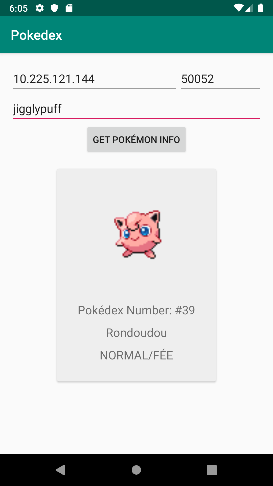

gRPC in action
==============

- `protobuf`: service definitions
- `androidapp`: the Android app
- `serverapp`: the server app 

There are 2 examples:
  - the basic `Hello World example, forked from the offical example 
  - and a slightly advanced `Pokédex` example: it retrieves the pokémon's information 
  in French when searching with its English name

The full article can be found [here](article/article.md)