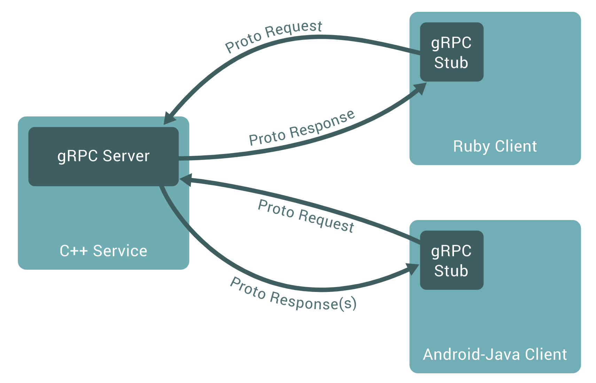
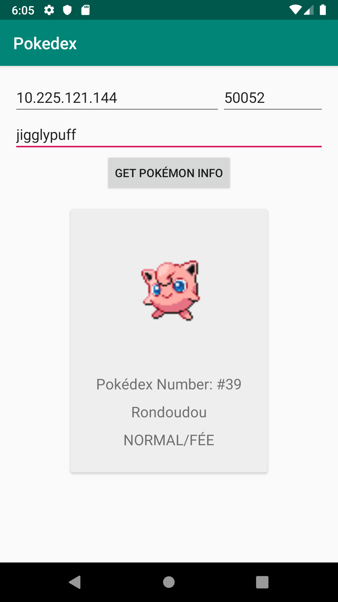

Post-REST: Build your next Android app with gRPC
================================================

RESTful API has been around for almost 20 years. First introduced and defined [by Roy Fielding in 2000](https://en.wikipedia.org/wiki/Representational_state_transfer) in parallel with HTTP 1.1, it has been a pillar of building web services. As years go by, we see more and more constraints of a typical RESTful service, mostly caused by some fundamental deficiencies in the design of HTTP 1.1. Google has actively participated in the definition of a new protocol. Its former alternative to HTTP1.x, SPDY, is now part of HTTP/2 protocol, aiming to build a faster and safer internet.

In recent years, companies started to embrace different approaches to solve their problems. We are seeing a growing number of projects using [GraphQL](https://graphql.org/learn/) to build more flexible web services; one of the alternatives that caught my eyes is gRPC.

# What is gRPC?

I'm an Android developer on a daily basis. I first came across this page among other Android documentations: [Build client-server applications with gRPC](https://developer.android.com/guide/topics/connectivity/grpc) and gRPC was not completely alien to me since my coworkers had been discussing it enthusiastically for a while.

gRPC is a new take on an old approach known as RPC ([Remote Procedure Call](https://en.wikipedia.org/wiki/Remote_procedure_call)), a form of inter-process communication essentially used for client-server interactions. The client can request to execute a procedure on the server as if it were a normal local procedure call thanks to the stub generated for both client and server.

The typical sequence of the RPC events runs like this:

- The client calls the client stub with parameters provided in the normal way
- The client stub then builds a message (marshalling) with the parameters and makes a system call to send the message to the server 
- The message is sent to the server by the client's local operating system 
- The server's local operating system passes the incoming message to the server stub
- The server stub unpacks the parameters from the message (unmarshalling)
- At the end the server stub calls the server procedure with the parameters

Based on the same principle, [gRPC](https://grpc.io/) is an open-source RPC framework initially developed by Google and currently a [Cloud Native Computing Foundation](https://www.cncf.io/) incubating project. By default, gRPC uses HTTP/2 for transport and [Protocol Buffers](https://developers.google.com/protocol-buffers) as both its Interface Definition Language (IDL) and as its underlying message interchange format.



# REST v.s. gRPC

To grasp why gRPC is a fundamentally different approach to build web services. Let's do a [side-by-side comparison](https://speakerdeck.com/thesandlord/grpc-vs-rest-api-strat-2016) between REST and gRPC.

REST is basically JSON over HTTP 1.1 and gRPC is basically Protobuf over HTTP/2 with POST and choosing gRPC for a new project is still pretty experimental at the time of writing.

| JSON | Protocol Buffers |
|------|------------------|
| Plaintext | Binary |
| Human Readable | Machine Readable |
| Repetitive | Compressed |
| Fast (De)Serialization | Faster (De)Serialization |
| Everything supports it | Limited support |

| HTTP 1.1 | HTTP/2 |
|----------|--------|
| Plaintext | Binary |
| No Pipelining | Native Pipelining |
| New Connection Per Request | Persistent TCP Connection |
| Repetitive | Compressed |
| Polling | Streaming |
| Non-secure by default | TLS by default |
| Everything supports it | Limited support |

# gRPC in action: Pokédex

In order to demonstrate how gRPC can be used in a real project, I decided to build a simple Pokédex, which allows me to enter a Pokémon's English name and retrieve its Pokédex number, name in French, type in French and image. 

Why French though? Because ever since I live in France I realize that the Pokémon naming system is quite different here, for example Jigglypuff is called Rondoudou in French, which is total cuteness overflow. 


The sample project that I'm going to describe can be found here:
https://github.com/xebia-france/hello-grpc. It contains a simple **Hello World** example and the **Pokédex** example:

- Folder `protobuf` contains the `.proto` definitions
- Module `androidapp` is the client app in Android
- Module `serverapp` is the server implemented in Kotlin with gRPC Java

## 1. Define the service

gRPC uses [Protocol Buffers](https://developers.google.com/protocol-buffers) as the Interface Definition Language (IDL) for describing both the service interface and the structure of the payload messages.

Let's start by defining the Pokédex service interfaces and the data structure of the messages exchanged between the client and the server: 

- Client side: the application takes a Pokémon's English name as input parameter
- Server side: the application receives the Pokémon's English name and it returns the information of this Pokémon (Pokédex number, French name, type, image URL) if it can be found.

Here is the `Pokedex.proto` with a simple unary implementation where the client sends a single request to the server and gets a single response back:

```protobuf
syntax = "proto3";

option java_multiple_files = true;
option java_package = "fr.xebia.hellogrpc";
option java_outer_classname = "PokedexProto";
option objc_class_prefix = "PD";

package pokedex;

service Pokedex {
    // get information of a Pokémon in French
    rpc GetPokemon (PokedexRequest) returns (PokedexReply) {}
}

// The request message containing the Pokémon's English name.
message PokedexRequest {
    string englishName = 1;
}

// The response message containing the Pokémon's information in French
message PokedexReply {
    int32 id = 1;
    string frenchName = 2;
    string type = 3;
    string imageUrl = 4;
}
```

There are in total 4 kinds of service method:
- Unary RPCs
- Server streaming RPCs
- Client streaming RPCs
- Bidirectional streaming RPCs

In this article I'm not going to deep dive into stream related RPCs, but you can find detailed explanation [here](https://grpc.io/docs/guides/concepts/).

## 2. Generate Java bindings

Once the service is defined, we need to generate the bindings for the language of our choice. Currently gRPC supports most of the main stream programming languages. In this project I decided to use the [gRPC Java](https://github.com/grpc/grpc-java) implementation and code my server app with Kotlin.

Before jumping into the implementation, let's generate the binding manually to have a better idea of what is behind the scaffolding.

To generate the binding in Java we need 2 tools:
- the [protocol buffer compiler](https://github.com/protocolbuffers/protobuf)
- the [gRPC Java Codegen Plugin for Protobuf Compiler](https://github.com/grpc/grpc-java/tree/master/compiler)

Make sure both tools are added to your `PATH`. You can now generate the Java interface out of the service definition like this: 

```
$ protoc --plugin=protoc-gen-grpc-java --grpc-java_out=src/main/grpc --java_out=src/main/java/ --proto_path=src/main/proto pokedex.proto
```

- `--plugin`: this option indicates which plugin the compiler should use to generate code, in our case it's the Java plugin that we need.
- `--grpc-java_out`: this option indicates the output folder for the generated gRPC java class.
- `--java_out`: this option indicates the output folder for the generated java class for protobuf objects.
- `--proto_path`: this option indicates the folder which `.proto` file is located.
- at the end, do not forget to specify the `.proto` file name to get everything rolling

In the gRPC java output folder, you should be able to find the generated class `PokedexGrpc.java` which contains the stub of the service.

In the java output folder, you should be able to find the following generated classes which describe the request and the response objects:
- `PokedexProto`
- `PokedexReply`
- `PokedexReplyOrBuilder`
- `PokedexRequest`
- `PokedexRequestOrBuilder`

## 3. Implement the server side logic

Now that you have a better idea about what is generated behind the scene, let's move the project into IntelliJ and code a `PokedexServer`.

Specify the usage of gRPC Java Codegen Plugin for Protobuf Compiler in the `build.gradle` and the code generation will be taken care of:
```
// ...

protobuf {
    protoc {
        artifact = "com.google.protobuf:protoc:$protocVesrion"
    }
    plugins {
        grpc {
            artifact = "io.grpc:protoc-gen-grpc-java:$grpcVersion"
        }
    }
    generateProtoTasks {
        ofSourceSet("main").forEach {
            it.plugins { grpc {} }
        }
    }
}
```

gRPC provides classes such as `Server` and `ServerBuilder` which allow us to start a simple service in just a few lines of code. The most important part is to implement the abstract method `getPokemon` inside the generated class `PokedexGrpc.PokedexImplBase` in our case, delivering the data requested by client.

Here is an extract of the Server implementation:

```Kotlin
class PokedexServer {

    private val port = 50052
    private var server: Server? = null

    @Throws(IOException::class)
    private fun start() {
        //...
        
        server = ServerBuilder.forPort(port)
            .addService(PokedexImpl())
            .build()
            .start()
    
        Runtime.getRuntime().addShutdownHook(object : Thread() {
            override fun run() {
                System.err.println("*** shutting down gRPC server since JVM is shutting down")
                this@PokedexServer.stop()
                System.err.println("*** server shut down")
            }
        })
    }

    private fun stop() {
        server?.shutdown()
    }

    internal class PokedexImpl() : PokedexGrpc.PokedexImplBase() {

        override fun getPokemon(request: PokedexRequest, responseObserver: StreamObserver<PokedexReply>) {
            
            val englishName = request.englishName
            
            // logic of find the pokemon info...

            val reply = PokedexReply.newBuilder()
                    .setId("pokemon ID" )
                    .setFrenchName("pokemon French name")
                    .setType("pokemon type")
                    .setImageUrl("pokemon image URL")
                    .build()
        
            responseObserver.onNext(reply)
            responseObserver.onCompleted()
        }
    }

    companion object {
        @Throws(IOException::class, InterruptedException::class)
        @JvmStatic
        fun main(args: Array<String>) {
            val server = PokedexServer()
            server.start()
            server.blockUntilShutdown()
        }
    }

}
```

Once you finish implementing the server-side logic, you can write a test to see if the server returns the expected value. There are examples that you can find on [GitHub](https://github.com/grpc/grpc-java/tree/master/examples). gRPC provides classes such as `GrpcCleanupRule`, `InProcessServerBuilder` to make unit testing easier.

You can check [PokedexServer](https://github.com/xebia-france/hello-grpc/blob/master/serverapp/src/main/kotlin/fr/xebia/hellogrpc/PokedexServer.kt) to see the full implementation and [PokedexServerTest](https://github.com/xebia-france/hello-grpc/blob/master/serverapp/src/test/kotlin/fr/xebia/hellogrpc/PokedexServerTest.kt) for the unit test.

## 4. Build the Pokédex app with Android

Now that our server is up and running, it's time to build the client app. This is for me the most exciting part. Let's keep going o//

If you are an Android developer, you have probably used [OKHttp](https://square.github.io/okhttp/) and [Retrofit](https://square.github.io/retrofit/) for making your network calls. gRPC provides dedicated plugin (`protoc-gen-javalite`) and libraries (`grpc-okhttp` and `grpc-protobuf-lite`) for Android platform:

Here is an extract of the `build.gradle` of my Android application:

```Groovy
dependencies {
    //...

    implementation "io.grpc:grpc-okhttp:$grpcVersion"
    implementation "io.grpc:grpc-protobuf-lite:$grpcVersion"
}

protobuf {
    protoc {
        artifact = "com.google.protobuf:protoc:$protocVesrion"
    }
    plugins {
        javalite {
            artifact = "com.google.protobuf:protoc-gen-javalite:3.0.0"
        }
        grpc {
            artifact = "io.grpc:protoc-gen-grpc-java:$grpcVersion"
        }
    }
    generateProtoTasks {
        all().each { task ->
            task.plugins {
                javalite {}
                grpc {
                    // Options added to --grpc_out
                    option 'lite'
                }
            }
        }
    }
}
```

To build the application the Android way, I used Architecture Components and Kotlin 
coroutines, along with the [ViewModel kotlin extension](https://medium.com/androiddevelopers/easy-coroutines-in-android-viewmodelscope-25bffb605471).

Here is the `getPokemon` call inside the `PokedexViewModel`, launched with the `ViewModelScope` in a coroutine, the response is then passed on to LiveData which is observed by my Activity:

```Kotlin
import androidx.lifecycle.LiveData
import androidx.lifecycle.MutableLiveData
import androidx.lifecycle.ViewModel
import androidx.lifecycle.viewModelScope
import io.grpc.ManagedChannelBuilder
import kotlinx.coroutines.Dispatchers
import kotlinx.coroutines.launch

class PokedexViewModel : ViewModel() {

    val pokemonLiveDate: LiveData<GetPokemonResult> get() = _pokemonLiveData
    private val _pokemonLiveData = MutableLiveData<GetPokemonResult>()

    fun getPokemon(host: String, portStr: String, message: String) {
        viewModelScope.launch(Dispatchers.IO) {
            try {
                val port = if (portStr.isEmpty()) 0 else portStr.toInt()
                val channel = ManagedChannelBuilder.forAddress(host, port).usePlaintext().build()
                val stub = PokedexGrpc.newBlockingStub(channel)
                val request = PokedexRequest.newBuilder().setEnglishName(message.trim()).build()
                val reply = stub.getPokemon(request)
                _pokemonLiveData.postValue(GetPokemonResult.Success(reply))
                channel.shutdown()
            } catch (e: Exception) {
                e.printStackTrace()
                _pokemonLiveData.postValue(GetPokemonResult.Error(e))
            }
        }
    }
}

sealed class GetPokemonResult {
    data class Success(val reply: PokedexReply) : GetPokemonResult()
    data class Error(val exception: Exception) : GetPokemonResult()
}
```

To test this implementation, start the application and connect to the Pokédex server and search the Pokémon!



# Conclusion

Building a mobile application is actually harder than it appears. We are constantly concerning about things such as battery usage, cellular data consumption, connection latency, device storage or security. The list goes on and on. A good mobile application should take account of all these criterias. But our current solutions are full of pain points. Even if a little bit premature, gRPC tackles some of these by the means of a much faster exchange protocol and a good conveniency in writing the associated code, thanks to its support of the most widespread libraries and languages available. 

And most of all, it was fun experimenting!
